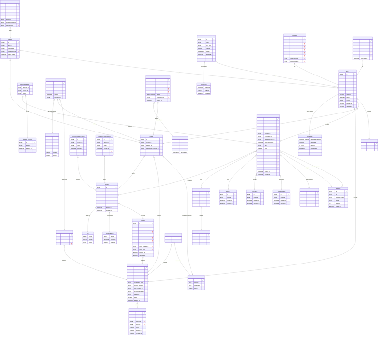
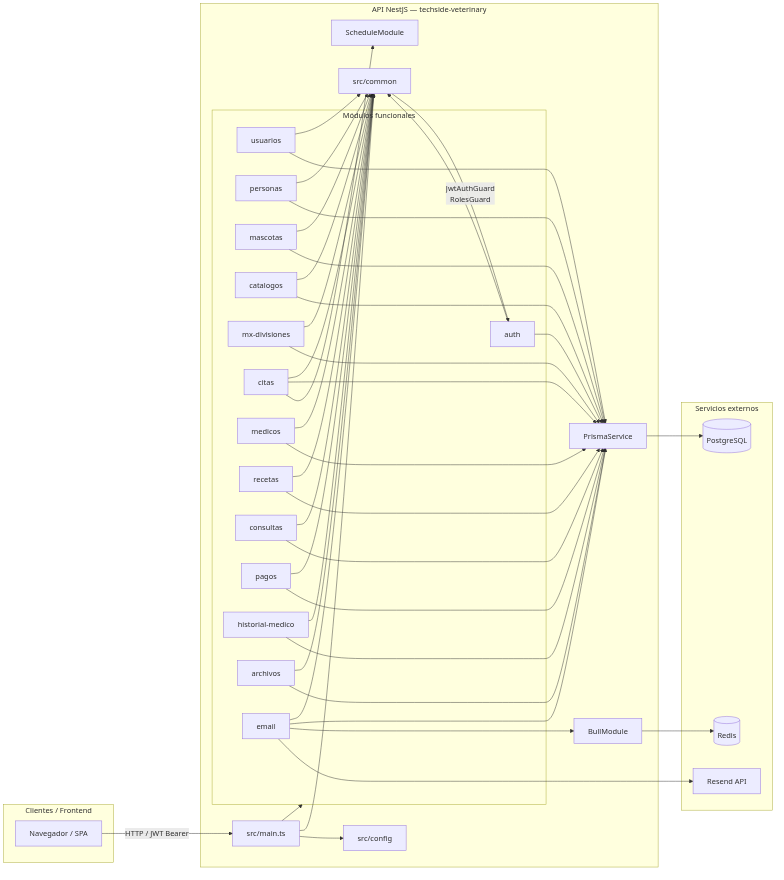

# 2. Diseño Técnico del Sistema de Información

## 2.1 Requerimientos funcionales y reglas de negocio

Las siguientes reglas de negocio se implementan en el módulo de citas [Fuente: `src/citas/citas.service.ts`]:

| ID | Regla | Fuente |
|----|-------|--------|
| V-01 | Solo un usuario con rol `cliente` o `admin` puede crear citas. | `[Fuente: src/citas/citas.service.ts]` |
| V-02 | Un cliente solo puede agendar citas para sus propias mascotas; el administrador puede agendar en nombre de otro usuario mediante `emailUsuario`. | `[Fuente: src/citas/citas.service.ts]` |
| V-03 | Las citas deben programarse con al menos 24 horas de anticipación y como máximo 2 meses hacia adelante. | `[Fuente: src/citas/citas.service.ts]` |
| V-04 | La fecha y hora de la cita deben ser futuras. | `[Fuente: src/citas/citas.service.ts]` |
| V-05 | Solo puede existir una cita no cancelada por mascota, médico y día. | `[Fuente: src/citas/citas.service.ts]` |
| V-06 | No puede haber traslape de horarios para un mismo médico. | `[Fuente: src/citas/citas.service.ts]` |
| V-07 | El consultorio se deriva del horario del médico para el día de la semana correspondiente. | `[Fuente: src/citas/citas.service.ts]` |
| V-08 | No puede haber traslape de consultorio ni de paciente dentro de la misma sucursal. | `[Fuente: src/citas/citas.service.ts]` |
| V-09 | Si la cita es en una sucursal distinta a otra cita del mismo paciente, debe existir una diferencia de al menos 2 horas. | `[Fuente: src/citas/citas.service.ts]` |
| — | El precio de la cita se calcula como `servicio.precioBase + medico.especialidadPrincipal.precio`. | `[Fuente: API-DOCS.md]` |
| — | El folio de pago sigue el formato `VET-YYYYMMDD-NNNN`. | `[Fuente: API-DOCS.md]` |

## 2.2 Stack tecnológico

| Capa | Tecnología | Versión / Nota | Fuente |
|------|------------|----------------|--------|
| Runtime | Node.js | 20+ | `[Fuente: README.md, package.json]` |
| Gestor de paquetes | pnpm | 11.7.0 (`packageManager`) | `[Fuente: package.json]` |
| Framework | NestJS | 11.0.x | `[Fuente: package.json]` |
| Lenguaje | TypeScript | 5.7.3 | `[Fuente: package.json]` |
| ORM | Prisma | 6.19.3 | `[Fuente: package.json]` |
| Base de datos | PostgreSQL | 15+ | `[Fuente: README.md, prisma/schema.prisma]` |
| Cola / caché | Redis + Bull | Redis 7+, `bull` 4.16.5 | `[Fuente: package.json, README.md]` |
| Autenticación | JWT + Passport | `@nestjs/jwt` 11.0.2 | `[Fuente: package.json]` |
| Validación de esquemas | Zod | 4.4.3 | `[Fuente: package.json]` |
| Documentación API | Swagger / OpenAPI | `@nestjs/swagger` 11.0.0 | `[Fuente: package.json]` |
| Seguridad HTTP | Helmet | 8.2.0 | `[Fuente: package.json]` |
| Correos electrónicos | Resend | 6.12.4 | `[Fuente: package.json]` |
| Generación de PDF | PDFKit | 0.19.0 | `[Fuente: package.json]` |
| Tareas programadas | `@nestjs/schedule` | 6.1.3 | `[Fuente: package.json]` |
| Pruebas | Jest + Supertest | Jest 30 | `[Fuente: package.json]` |
| Lint / Formato | ESLint 9 + Prettier | `typescript-eslint`, Prettier 3.4.2 | `[Fuente: package.json]` |

## 2.3 Estándares de código y arquitectura

### Organización de módulos

Cada dominio de negocio reside en un módulo NestJS bajo `src/<dominio>/`. Cada módulo típicamente contiene `controller`, `service`, `module` y `dto` [Fuente: `src/app.module.ts`, `README.md`].

### Componentes comunes (`src/common`)

| Componente | Ubicación | Propósito |
|------------|-----------|-----------|
| `JwtAuthGuard` | `src/common/guards/jwt-auth.guard.ts` | Protege endpoints que requieren JWT válido. |
| `RolesGuard` | `src/common/guards/roles.guard.ts` | Verifica jerarquía de roles (`cliente < médico < admin`). |
| `@Roles` | `src/common/decorators/roles.decorator.ts` | Declara roles requeridos en controladores. |
| `SanitizeInterceptor` | `src/common/interceptors/sanitize.interceptor.ts` | Elimina etiquetas HTML de las solicitudes. |
| `HttpExceptionFilter` | `src/common/filters/http-exception.filter.ts` | Normaliza errores y oculta stack traces en producción. |

### Validación de entrada

La API utiliza `ZodValidationPipe` para validar DTOs con esquemas Zod [Fuente: `package.json`, `src/config/env.validation.ts`].

## 2.4 Modelo de datos

### Diagrama entidad-relación

El siguiente diagrama se genera automáticamente desde `prisma/schema.prisma` mediante `prisma-erd-generator`:

### Diccionario de datos

#### Enums

| Enum | Valores | Descripción | Fuente |
|------|---------|-------------|--------|
| `Rol` | `cliente`, `medico`, `admin` | Roles de usuario. | `[Fuente: prisma/schema.prisma]` |
| `UsuarioStatus` | `activo`, `pendiente`, `inactivo` | Estados de cuenta de usuario. | `[Fuente: prisma/schema.prisma]` |
| `EstadoPago` | `pendiente`, `pagada`, `cancelada` | Estados del pago asociado a una cita. | `[Fuente: prisma/schema.prisma]` |
| `EstadoCita` | `pendiente_de_pago`, `pendiente`, `en_curso`, `inasistencia`, `completada`, `cancelada` | Estados del ciclo de vida de una cita. | `[Fuente: prisma/schema.prisma]` |
| `EstadoAsistencia` | `asistencia`, `falta`, `retardo`, `justificado`, `incapacidad` | Estados de asistencia del médico. | `[Fuente: prisma/schema.prisma]` |
| `DiaSemana` | `domingo` … `sabado` | Días de la semana para horarios médicos. | `[Fuente: prisma/schema.prisma]` |

#### Modelos del dominio de usuarios y catálogos

| Modelo | Campos principales | Relaciones | Tabla en BD |
|--------|-------------------|------------|-------------|
| `MxDivision` | `id`, `nombre`, `clave`, `direccion`, `telefono`, `activo` | 1:N con `Sucursal` | `mx_divisiones` |
| `Persona` | `id`, `nombreCompleto`, `telefono`, `telefonoSecundario`, `calle`, `numExterior`, `numInterior`, `sucursalId` | N:1 con `Sucursal`; 1:1 con `Usuario` | `persona` |
| `Usuario` | `id`, `email`, `telefono`, `passwordHash`, `rol`, `status`, `personaId` | 1:1 con `Persona`; 1:N con `Mascota`, `EmailVerificationToken`, `PasswordResetToken`; 1:0..1 con `Medico` | `usuario` |
| `Archivo` | `id`, `url`, `nombreArchivo`, `mime`, `tamano`, `subidoEn` | N:M con `Mascota` (foto de perfil, carnet de vacunación) | `archivos` |
| `EmailVerificationToken` | `id`, `usuarioId`, `token`, `expiresAt`, `usedAt` | N:1 con `Usuario` | `email_verification_tokens` |
| `PasswordResetToken` | `id`, `usuarioId`, `token`, `expiresAt`, `usedAt` | N:1 con `Usuario` | `password_reset_tokens` |
| `Especie` | `id`, `nombre` | 1:N con `Raza` | `especies` |
| `Raza` | `id`, `nombre`, `especieId` | N:1 con `Especie`; 1:N con `Mascota` | `razas` |
| `Color` | `id`, `nombre` | 1:N con `Mascota` | `colores` |
| `TipoPelo` | `id`, `nombre` | 1:N con `Mascota` | `tipos_pelo` |
| `PatronPelo` | `id`, `nombre` | 1:N con `Mascota` | `patrones_pelo` |
| `Comportamiento` | `id`, `nombre`, `requiereBozal` | 1:N con `Mascota` | `comportamientos` |
| `CatalogoAlergia` | `id`, `nombre` | N:M con `Mascota` vía `MascotaAlergia` | `catalogo_alergias` |
| `Mascota` | `id`, `propietarioId`, `nombre`, `razaId`, `colorId`, `tipoPeloId`, `patronPeloId`, `comportamientoId`, `fechaNacimiento`, `sexo`, `peso`, `esterilizado`, `ruac`, `microchip`, `tatuaje`, `fotoPerfilId`, `carnetVacunacionId`, `observaciones` | N:1 con `Usuario`; N:1 con `Raza`, `Color`, `TipoPelo`, `PatronPelo`, `Comportamiento`; N:M con `CatalogoAlergia`; 1:N con `Cita` | `mascotas` |
| `MascotaAlergia` | `mascotaId`, `alergiaId`, `notas` | Entidad de unión N:M | `mascota_alergias` |

#### Modelos del dominio médico

| Modelo | Campos principales | Relaciones | Tabla en BD |
|--------|-------------------|------------|-------------|
| `Sucursal` | `id`, `nombre`, `calleNumero`, `ubicacionId`, `mapaCoords`, `descripcionWeb`, `horarioAtencion`, `fotoPortadaId`, `telefonoPrincipal`, `whatsapp`, `activo` | N:1 con `MxDivision`; 1:N con `Persona`, `Consultorio`, `Medico`, `Cita`; N:M con `Especialidad` | `sucursales` |
| `Consultorio` | `id`, `sucursalId`, `nombre`, `equipamiento` | N:1 con `Sucursal`; 1:N con `MedicoHorario` | `consultorios` |
| `Especialidad` | `id`, `nombre`, `descripcion`, `precio` | 1:N con `Medico`; N:M con `Sucursal` | `especialidades` |
| `Servicio` | `id`, `nombre`, `precioBase` | 1:N con `Cita` | `servicios` |
| `SucursalEspecialidad` | `sucursalId`, `especialidadId` | Entidad de unión N:M | `sucursales_especialidades` |
| `Medico` | `id`, `usuarioId`, `sucursalId`, `especialidadPrincipalId`, `cedulaProfesional`, `biografiaCorta` | 1:1 con `Usuario`; N:1 con `Sucursal`, `Especialidad`; 1:N con `MedicoHorario`, `MedicoAsistencia`, `Cita`, `Receta` | `medicos` |
| `MedicoHorario` | `id`, `medicoId`, `diaSemana`, `horaInicio`, `horaFin`, `consultorioId` | N:1 con `Medico`, `Consultorio` | `medico_horarios` |
| `MedicoAsistencia` | `id`, `medicoId`, `fecha`, `horaEntradaReal`, `horaSalidaReal`, `estado`, `observaciones` | N:1 con `Medico` | `medico_asistencias` |
| `Cita` | `id`, `sucursalId`, `medicoId`, `mascotaId`, `servicioId`, `fecha`, `horaInicio`, `horaFin`, `estado`, `motivo` | N:1 con `Sucursal`, `Medico`, `Mascota`, `Servicio`; 1:0..1 con `Receta`, `Consulta`, `Pago`; 1:N con `CitaEstadoHistorial` | `citas` |
| `Receta` | `id`, `citaId`, `diagnostico`, `observaciones`, `fechaReceta`, `medicoId` | N:1 con `Medico`; 1:1 con `Cita`; 1:N con `DetalleReceta` | `recetas` |
| `DetalleReceta` | `id`, `recetaId`, `medicamento`, `dosis`, `frecuencia`, `duracion`, `viaAdministracion`, `instrucciones` | N:1 con `Receta` | `detalles_receta` |
| `Pago` | `id`, `citaId`, `folioPago`, `cantidad`, `estado`, `fechaPago` | 1:1 con `Cita` | `pagos` |
| `Consulta` | `id`, `citaId`, `peso`, `temperatura`, `frecuenciaCardiaca`, `frecuenciaRespiratoria`, `presionArterial`, `estadoGeneral`, `notasEvolucion` | 1:1 con `Cita` | `consultas` |
| `CitaEstadoHistorial` | `id`, `citaId`, `estadoAnterior`, `estadoNuevo`, `usuarioId`, `razon`, `fechaCambio` | N:1 con `Cita` | `cita_estado_historial` |

## 2.5 Funcionalidad y servicios

### Diagrama de componentes

### Endpoints principales por rol

| Módulo | Prefijo | Endpoint | Método | Rol mínimo | Fuente |
|--------|---------|----------|--------|------------|--------|
| App | `/` | `/` | GET | Público | `[Fuente: src/app.controller.ts]` |
| Auth | `/auth` | `/login` | POST | Público | `[Fuente: API-DOCS.md]` |
| Auth | `/auth` | `/register` | POST | Público (médico/admin requiere JWT) | `[Fuente: API-DOCS.md]` |
| Auth | `/auth` | `/verify` | GET | Público | `[Fuente: API-DOCS.md]` |
| Auth | `/auth` | `/resend-confirmation` | POST | Público | `[Fuente: API-DOCS.md]` |
| Usuarios | `/usuarios` | `/` | GET | `medico` | `[Fuente: API-DOCS.md]` |
| Personas | `/personas` | `/me` | GET | Autenticado | `[Fuente: API-DOCS.md]` |
| Personas | `/personas` | `/me` | PATCH | Autenticado | `[Fuente: API-DOCS.md]` |
| Mascotas | `/mascotas` | `/` | POST | `cliente` | `[Fuente: API-DOCS.md]` |
| Mascotas | `/mascotas` | `/` | GET | `cliente` | `[Fuente: API-DOCS.md]` |
| Mascotas | `/mascotas` | `/:id` | GET | `cliente` | `[Fuente: API-DOCS.md]` |
| Mascotas | `/mascotas` | `/:id` | PATCH | `cliente` propietario / `admin` | `[Fuente: API-DOCS.md]` |
| Catálogos | `/catalogos` | `/*` | GET | Autenticado | `[Fuente: API-DOCS.md]` |
| Sucursales | `/mx-divisiones` | `/*` | GET | Autenticado | `[Fuente: API-DOCS.md]` |
| Sucursales | `/sucursales` | `/` | GET | Público | `[Fuente: API-DOCS.md]` |
| Especialidades | `/api/v1/especialidades` | `/` | GET | Autenticado | `[Fuente: API-DOCS.md]` |
| Médicos | `/api/v1/medicos` | `/` | POST | `admin` | `[Fuente: API-DOCS.md]` |
| Médicos | `/api/v1/medicos` | `/` | GET | Autenticado | `[Fuente: API-DOCS.md]` |
| Médicos | `/api/v1/medicos` | `/:id` | GET | Autenticado | `[Fuente: API-DOCS.md]` |
| Médicos | `/api/v1/medicos` | `/:id` | PATCH | `admin` | `[Fuente: API-DOCS.md]` |
| Médicos | `/api/v1/medicos` | `/:id/horarios` | POST | `admin` | `[Fuente: API-DOCS.md]` |
| Médicos | `/api/v1/medicos` | `/:id/horarios/:horarioId` | PATCH | `admin` | `[Fuente: API-DOCS.md]` |
| Médicos | `/api/v1/medicos` | `/:id/horarios/:horarioId` | DELETE | `admin` | `[Fuente: API-DOCS.md]` |
| Médicos | `/api/v1/medicos` | `/:id/asistencias` | POST | `admin` | `[Fuente: API-DOCS.md]` |
| Médicos | `/api/v1/medicos` | `/:id/asistencias` | GET | `admin` / médico propio | `[Fuente: API-DOCS.md]` |
| Médicos | `/api/v1/medicos` | `/:id/asistencias/salida` | POST | `admin` / médico propio | `[Fuente: API-DOCS.md]` |
| Médicos | `/api/v1/medicos` | `/:id/disponibilidad-dias` | GET | Autenticado | `[Fuente: API-DOCS.md]` |
| Médicos | `/api/v1/medicos` | `/:id/disponibilidad-slots` | GET | Autenticado | `[Fuente: API-DOCS.md]` |
| Citas | `/api/v1/citas` | `/` | POST | `cliente` / `admin` | `[Fuente: API-DOCS.md]` |
| Citas | `/api/v1/citas` | `/` | GET | Autenticado | `[Fuente: API-DOCS.md]` |
| Citas | `/api/v1/citas` | `/:id` | GET | Autenticado | `[Fuente: API-DOCS.md]` |
| Citas | `/api/v1/citas` | `/:id` | PATCH | `cliente` propietario / `admin` | `[Fuente: API-DOCS.md]` |
| Citas | `/api/v1/citas` | `/:id/estado` | PATCH | `medico` / `admin` | `[Fuente: API-DOCS.md]` |
| Citas | `/api/v1/citas` | `/:id` | DELETE | `cliente` propietario / `admin` | `[Fuente: API-DOCS.md]` |
| Recetas | `/api/v1/recetas` | `/` | POST | `medico` / `admin` | `[Fuente: API-DOCS.md]` |
| Recetas | `/api/v1/recetas` | `/` | GET | Autenticado | `[Fuente: API-DOCS.md]` |
| Recetas | `/api/v1/recetas` | `/:id` | GET | Autenticado | `[Fuente: API-DOCS.md]` |
| Recetas | `/api/v1/recetas` | `/cita/:citaId` | GET | Autenticado | `[Fuente: API-DOCS.md]` |
| Consultas | `/api/v1/consultas` | `/` | POST | `medico` / `admin` | `[Fuente: API-DOCS.md]` |
| Consultas | `/api/v1/consultas` | `/` | GET | Autenticado | `[Fuente: API-DOCS.md]` |
| Consultas | `/api/v1/consultas` | `/:id` | GET | Autenticado | `[Fuente: API-DOCS.md]` |
| Consultas | `/api/v1/consultas` | `/cita/:citaId` | GET | Autenticado | `[Fuente: API-DOCS.md]` |
| Consultas | `/api/v1/consultas` | `/:id` | PATCH | `medico` / `admin` | `[Fuente: API-DOCS.md]` |
| Pagos | `/api/v1/pagos` | `/` | POST | Autenticado | `[Fuente: API-DOCS.md]` |
| Pagos | `/api/v1/pagos` | `/` | GET | Autenticado | `[Fuente: API-DOCS.md]` |
| Pagos | `/api/v1/pagos` | `/:folioPago` | GET | Autenticado | `[Fuente: API-DOCS.md]` |
| Historial médico | `/mascotas/:id/historial` | `/*` | GET | Autenticado | `[Fuente: API-DOCS.md]` |
| Historial médico | `/admin/historial-mascotas` | `/` | GET | `admin` | `[Fuente: API-DOCS.md]` |

### Máquina de estados de la cita (`EstadoCita`)

| Estado actual | Estado destino | Disparador | Fuente |
|---------------|----------------|------------|--------|
| `pendiente_de_pago` | `pendiente` | Pago exitoso (`POST /api/v1/pagos`) | `[Fuente: API-DOCS.md]` |
| `pendiente_de_pago` | `cancelada` | Cron de no pago (deadline superado) | `[Fuente: src/citas/citas-cron.service.ts]` |
| `pendiente` | `en_curso` | Cron cada 5 min al llegar la hora de inicio | `[Fuente: src/citas/citas-cron.service.ts]` |
| `pendiente` | `cancelada` | Cambio manual por médico/admin | `[Fuente: API-DOCS.md]` |
| `en_curso` | `completada` | Registro de `Consulta` y `Receta` | `[Fuente: API-DOCS.md]` |
| `en_curso` | `inasistencia` | Cambio manual por médico/admin | `[Fuente: API-DOCS.md]` |
| `en_curso` | `cancelada` | Cambio manual por médico/admin | `[Fuente: API-DOCS.md]` |

### Máquina de estados del pago (`EstadoPago`)

| Estado actual | Estado destino | Disparador | Fuente |
|---------------|----------------|------------|--------|
| `pendiente` | `pagada` | Registro manual del pago | `[Fuente: API-DOCS.md]` |
| `pendiente` | `cancelada` | Cancelación manual o por cron | `[Fuente: API-DOCS.md]` |

## 2.6 Autenticación y autorización

### Autenticación

- La API utiliza tokens JWT Bearer [Fuente: `API-DOCS.md`].
- El token se obtiene en `POST /auth/login` y se envía en el header `Authorization: Bearer <token>` [Fuente: `API-DOCS.md`].
- La estrategia JWT extrae el token del header, valida `JWT_SECRET` y no sobrescribe la expiración [Fuente: `src/auth/strategies/jwt.strategy.ts`].
- Las contraseñas se hashean con bcrypt; el número de rondas por defecto es 12 (`BCRYPT_ROUNDS`) [Fuente: `src/config/env.validation.ts`].

### Autorización

- `JwtAuthGuard` protege los endpoints que requieren autenticación.
- `RolesGuard` verifica que el rol del usuario cumpla la jerarquía mínima requerida por el decorador `@Roles` [Fuente: `src/common/guards/roles.guard.ts`].
- La jerarquía es numérica: `cliente=1`, `medico=2`, `admin=3` [Fuente: `src/common/guards/roles.guard.ts`].

## 2.7 Integraciones externas

| Sistema | Uso | Configuración | Fuente |
|---------|-----|---------------|--------|
| PostgreSQL | Persistencia de datos | `DATABASE_URL` | `[Fuente: prisma/schema.prisma, src/config/env.validation.ts]` |
| Redis | Cola de correos y caché para Bull | `REDIS_URL` | `[Fuente: src/app.module.ts, src/config/env.validation.ts]` |
| Resend | Envío de correos de verificación y cuenta existente | `RESEND_API_KEY` | `[Fuente: src/email/email.service.ts, src/config/env.validation.ts]` |
| Almacenamiento local | Archivos adjuntos (fotos de mascota, carnets, documentos) | Directorio `./uploads` | `[Fuente: src/archivos/archivos.service.ts]` |

## 2.8 Consideraciones de seguridad

| Medida | Descripción | Fuente |
|--------|-------------|--------|
| Helmet | Aplica headers de seguridad HTTP en todas las respuestas. | `[Fuente: src/main.ts]` |
| CORS | Orígenes permitidos resueltos por `resolveCorsOrigin`; en producción requiere `FRONTEND_URL`. | `[Fuente: src/config/cors.config.ts, src/main.ts]` |
| Sanitización | `SanitizeInterceptor` elimina etiquetas `<script>` y HTML de los cuerpos de solicitud. | `[Fuente: src/common/interceptors/sanitize.interceptor.ts]` |
| Filtro de excepciones | `HttpExceptionFilter` oculta stack traces en errores 500. | `[Fuente: src/common/filters/http-exception.filter.ts]` |
| Rate limiting | `@nestjs/throttler` está instalado pero **no registrado globalmente** en `main`; se documenta como planificado. | `[Fuente: src/app.module.ts, package.json]` |

## 2.9 Requisitos técnicos mínimos

> **Nota:** los valores siguientes corresponden a los mínimos oficiales de cada tecnología y a la configuración del proyecto. El sizing real de producción depende de la carga de usuarios concurrentes y se marca como `[PENDIENTE]`.

| Componente | Requisito mínimo | Fuente |
|------------|------------------|--------|
| Node.js | 20.x LTS | `[Fuente: README.md]` |
| pnpm | 11.7.0 | `[Fuente: package.json]` |
| PostgreSQL | 15+ | `[Fuente: README.md, prisma/schema.prisma]` |
| Redis | 7+ | `[Fuente: README.md]` |
| CPU | `[PENDIENTE: definir según carga esperada]` | — |
| RAM | `[PENDIENTE: definir según carga esperada]` | — |
| Almacenamiento | `[PENDIENTE: definir según retención de datos]` | — |
