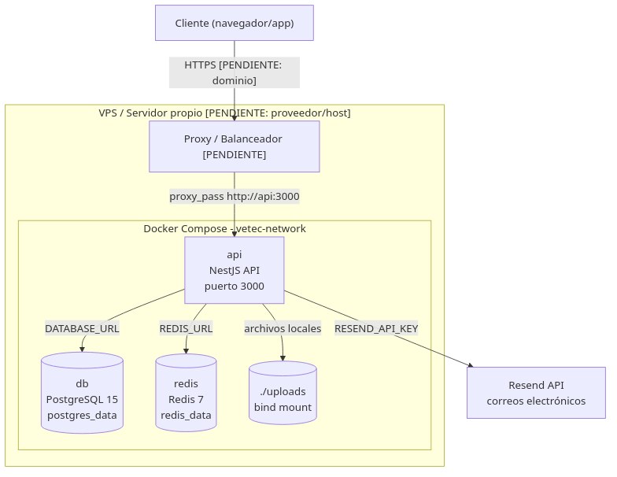

# 3. Despliegue y configuración

Este capítulo describe cómo instalar, configurar y poner en operación el backend `techside-veterinary` en un entorno local de desarrollo y en un VPS/servidor propio mediante contenedores Docker. Toda la información técnica se deriva del código, configuración y documentación comprometidos del repositorio.

## 3.1 Organización de componentes

La solución se compone de tres servicios principales que se ejecutan dentro de Docker Compose en un servidor propio [Fuente: `docker-compose.yml`, `src/app.module.ts`]:

- **API NestJS (`api`)**: servicio principal que expone la API REST en el puerto `3000` [Fuente: `src/main.ts`, `src/config/env.validation.ts`].
- **Base de datos PostgreSQL (`db`)**: persistencia de datos, imagen oficial `postgres:15` [Fuente: `docker-compose.yml`, `prisma/schema.prisma`].
- **Cola Redis (`redis`)**: utilizada por el módulo de correos electrónicos basado en Bull [Fuente: `docker-compose.yml`, `src/app.module.ts`, `src/email/`].

Además, la aplicación utiliza almacenamiento local de archivos en el directorio `./uploads` para fotos de perfil, carnets de vacunación y documentos de registro [Fuente: `src/archivos/archivos.service.ts`].



*Figura 3.1 — Diagrama de despliegue de la solución en contenedores. [Fuente: `diagramas/despliegue.mmd`]*

## 3.2 Requisitos previos de software

Antes de instalar el sistema, se requiere contar con el siguiente software base. Los mínimos oficiales se listan a continuación; el sizing real de hardware para producción es `[PENDIENTE: definir CPU/RAM/disco según volumen de usuarios concurrentes]`.

| Componente | Versión mínima | Uso | Fuente |
|------------|----------------|-----|--------|
| Node.js | 20 LTS | Runtime de la API | `README.md`, `package.json` |
| pnpm | 11.7.0 | Gestor de paquetes | `package.json#packageManager` |
| PostgreSQL | 15 | Base de datos relacional | `README.md`, `prisma/schema.prisma` |
| Redis | 7 | Cola de correos y caché | `docker-compose.yml` |
| Docker | 24.x | Contenerización | `[PENDIENTE: versión mínima oficial]` |
| Docker Compose | 2.x | Orquestación local/producción | `[PENDIENTE: versión mínima oficial]` |

## 3.3 Instalación local (desarrollo)

Para ejecutar el proyecto en una estación de trabajo local sin Docker, seguir los pasos documentados en `README.md` [Fuente: `README.md`]:

1. Clonar el repositorio:
   ```bash
   git clone <repo-url>
   cd techside-veterinary
   ```

2. Instalar dependencias:
   ```bash
   pnpm install
   ```

3. Configurar variables de entorno copiando el ejemplo:
   ```bash
   cp .env.example .env
   ```
   Editar `.env` con los valores locales (ver sección 3.5).

4. Generar el cliente de Prisma y aplicar migraciones:
   ```bash
   pnpm run db:generate
   pnpm run db:deploy
   ```

5. Poblar la base de datos con datos iniciales:
   ```bash
   pnpm run db:seed
   ```

6. Iniciar el servidor en modo desarrollo:
   ```bash
   pnpm run start:dev
   ```

La API estará disponible en `http://localhost:3000` y la documentación interactiva de Swagger en `/api/docs` (solo en entornos distintos a `production`) [Fuente: `src/main.ts`].

## 3.4 Instalación con Docker Compose

El repositorio incluye un `Dockerfile` y un `docker-compose.yml` para levantar la API junto con PostgreSQL y Redis [Fuente: `Dockerfile`, `docker-compose.yml`].

### Pasos

1. Clonar el repositorio y ubicarse en la raíz del proyecto.

2. Crear el archivo `.env` con al menos las variables obligatorias (ver sección 3.5). Ejemplo mínimo:
   ```dotenv
   NODE_ENV=production
   PORT=3000
   DATABASE_URL=postgresql://vetec:vetec_secret@db:5432/vetec?schema=public
   JWT_SECRET=<cadena-de-al-menos-32-caracteres>
   RESEND_API_KEY=<api-key-de-resend>
   REDIS_URL=redis://redis:6379
   BACKEND_BASE_URL=http://localhost:3000
   FRONTEND_URL=http://localhost:4200
   ```

3. Construir e iniciar los servicios:
   ```bash
   docker compose up --build -d
   ```

4. Aplicar migraciones y semilla (la primera vez):
   ```bash
   docker compose exec api pnpm run db:deploy
   docker compose exec api pnpm run db:seed
   ```

5. Verificar que la API responde:
   ```bash
   curl http://localhost:3000/
   ```

### Consideraciones sobre `pnpm-lock.yaml`

El repositorio actualmente **no incluye** `pnpm-lock.yaml` [Fuente: `git status`, estructura del repo]. El `Dockerfile` utiliza `pnpm install --frozen-lockfile=false` para permitir la construcción, lo que genera un árbol de dependencias no reproducible. Se recomienda generar y versionar el lockfile tan pronto como sea posible y posteriormente cambiar el `Dockerfile` a `--frozen-lockfile` [Fuente: `Dockerfile`].

## 3.5 Variables de entorno

La validación de variables de entorno se realiza en `src/config/env.validation.ts` [Fuente: `src/config/env.validation.ts`]. La siguiente tabla resume todas las variables reconocidas por la aplicación:

| Variable | Tipo | Obligatoria | Valor por defecto | Propósito |
|----------|------|:-----------:|-------------------|-----------|
| `NODE_ENV` | `development` \| `production` \| `test` | No | `development` | Ambiente de ejecución. En `production` se deshabilita Swagger [Fuente: `src/config/env.validation.ts`, `src/main.ts`]. |
| `PORT` | número | No | `3000` | Puerto HTTP de la API. |
| `DATABASE_URL` | cadena | Sí | — | URL de conexión a PostgreSQL. |
| `JWT_SECRET` | cadena (≥32 caracteres) | Sí | — | Clave para firmar tokens JWT. |
| `JWT_EXPIRES_IN` | cadena | No | `24h` | Tiempo de expiración del JWT. |
| `BCRYPT_ROUNDS` | número (≥10) | No | `12` | Rondas de hashing de contraseñas con bcrypt. |
| `RESEND_API_KEY` | cadena | Sí | — | API key para el envío de correos mediante Resend. |
| `REDIS_URL` | URL | No | `redis://localhost:6379` | Conexión a Redis para la cola de correos. |
| `FRONTEND_CONFIRMATION_SUCCESS_URL` | URL | No | — | URL de redirección tras verificación exitosa de correo. |
| `FRONTEND_CONFIRMATION_ERROR_URL` | URL | No | — | URL de redirección tras error en verificación de correo. |
| `FRONTEND_URL` | URL | No | — | Origen permitido para CORS. |
| `BACKEND_BASE_URL` | URL | No | `http://localhost:3000` | URL base para generar enlaces en correos electrónicos. |

### Variables adicionales de Docker Compose

El servicio `db` espera las siguientes variables para configurar PostgreSQL [Fuente: `docker-compose.yml`]:

| Variable | Valor por defecto | Descripción |
|----------|-------------------|-------------|
| `POSTGRES_USER` | `vetec` | Usuario administrador de PostgreSQL. |
| `POSTGRES_PASSWORD` | `vetec_secret` | Contraseña del usuario PostgreSQL. |
| `POSTGRES_DB` | `vetec` | Base de datos inicial. |

## 3.6 Configuración de CORS y seguridad

La API aplica las siguientes medidas de seguridad [Fuente: `src/main.ts`, `src/config/cors.config.ts`]:

- **CORS**: orígenes resueltos mediante `resolveCorsOrigin(frontendUrl, nodeEnv)`:
  - Si `FRONTEND_URL` está definido, se usa ese origen.
  - Si `NODE_ENV !== production`, se permite cualquier `http://localhost(:puerto)`.
  - En producción sin `FRONTEND_URL`, no se configura origen permitido.
- **Métodos permitidos**: `GET`, `POST`, `PUT`, `PATCH`, `DELETE`, `OPTIONS`.
- **Headers permitidos**: `Content-Type`, `Authorization`.
- `credentials: false`.
- **Helmet**: middleware de seguridad HTTP habilitado globalmente.
- **SanitizeInterceptor**: elimina etiquetas `<script>` y HTML del cuerpo de las peticiones.
- **HttpExceptionFilter**: normaliza errores y oculta stack traces en respuestas `500`.

> **Nota sobre rate limiting**: `@nestjs/throttler` se encuentra instalado como dependencia, pero su registro global está comentado en `src/app.module.ts`. Se documenta como funcionalidad planificada para la rama `main`; la rama `demos` lo mantiene deshabilitado para facilitar exposiciones [Fuente: `package.json`, `src/app.module.ts`].

## 3.7 Procedimiento de despliegue en VPS

Para desplegar en un servidor propio (VPS) se recomienda el siguiente flujo [Fuente: `docker-compose.yml`, `Dockerfile`]:

1. Copiar los archivos del proyecto al servidor (`Dockerfile`, `docker-compose.yml`, `.dockerignore`, `package.json`, `prisma/`, `src/`, `public/`).
2. Crear el archivo `.env` con las variables de producción.
3. Configurar un proxy inverso (por ejemplo, Nginx o Traefik) con certificado TLS. `[PENDIENTE: definir dominio y proxy]`.
4. Ejecutar `docker compose up --build -d`.
5. Aplicar migraciones: `docker compose exec api pnpm run db:deploy`.
6. Poblar datos iniciales: `docker compose exec api pnpm run db:seed`.
7. Verificar salud de contenedores: `docker compose ps` y `docker compose logs -f api`.

> **Consideraciones de producción pendientes**: dominio público, certificado TLS, política de backups aprobada, monitoreo/alertas, CI/CD y registry de imágenes son `[PENDIENTE]`.

## 3.8 Población inicial de datos

El script `prisma/seed.ts` se encarga de crear de forma idempotente [Fuente: `prisma/seed.ts`]:

- Tres sucursales (`Vetec Centro`, `Vetec Norte`, `Vetec Sur`).
- Un usuario administrador (`admin@vetec.local` / `AdminPass123`).
- Catálogos: especies, razas, colores, tipos de pelo, patrones de pelo, comportamientos, alergias.
- Especialidades médicas y servicios.
- Consultorios por sucursal.
- Datos de demostración: dos clientes, dos médicos, tres mascotas, ocho citas, consultas, recetas y pagos.

Para ejecutar el seed:
```bash
# Local
pnpm run db:seed

# Docker Compose
docker compose exec api pnpm run db:seed
```

## 3.9 Respaldo y restauración

Dado que no existe una política de respaldo aprobada en el repositorio, se propone la siguiente política genérica hasta su aprobación formal [Fuente: `spec.md`, acuerdo con el usuario]:

### PostgreSQL

- **Frecuencia**: diaria.
- **Herramienta**: `pg_dump`.
- **Retención**: 30 días.
- **Ejemplo de respaldo**:
  ```bash
  docker compose exec db pg_dump -U vetec -d vetec -Fc > vetec_$(date +%Y%m%d).dump
  ```
- **Ejemplo de restauración**:
  ```bash
  docker compose exec -T db pg_restore -U vetec -d vetec --clean < vetec_20260101.dump
  ```

### Redis

- **Frecuencia**: snapshot periódico mediante `BGSAVE`.
- **Retención**: 30 días.
- **Ejemplo**:
  ```bash
  docker compose exec redis redis-cli BGSAVE
  ```

> `[PENDIENTE: aprobar frecuencia, retención y herramienta oficiales de backup; definir procedimiento de recuperación ante desastres con RTO/RPO]`.

## 3.10 Verificación post-despliegue

Una vez desplegados los servicios, realizar las siguientes verificaciones [Fuente: `src/main.ts`, `Dockerfile`, `docker-compose.yml`]:

| Verificación | Comando / Acción | Resultado esperado |
|--------------|------------------|--------------------|
| API responde | `curl http://localhost:3000/` | Respuesta HTTP `200` con mensaje de bienvenida. |
| Healthcheck del contenedor `api` | `docker inspect --format='{{.State.Health.Status}}' vetec-api` | `healthy`. |
| PostgreSQL acepta conexiones | `docker compose exec db pg_isready -U vetec` | `accepting connections`. |
| Redis responde | `docker compose exec redis redis-cli ping` | `PONG`. |
| Swagger disponible (solo desarrollo) | Navegar a `http://localhost:3000/api/docs` | Interfaz de Swagger UI. |

---

*[PENDIENTE: definir URL pública de producción, proveedor de infraestructura, proxy/TLS, política de backups aprobada, monitoreo y canales de escalamiento].*
